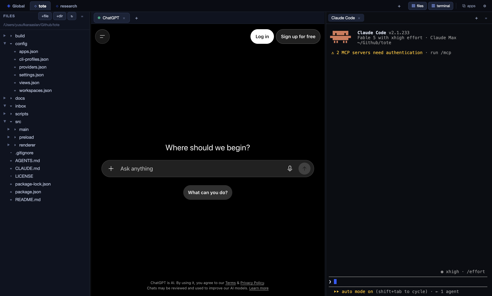
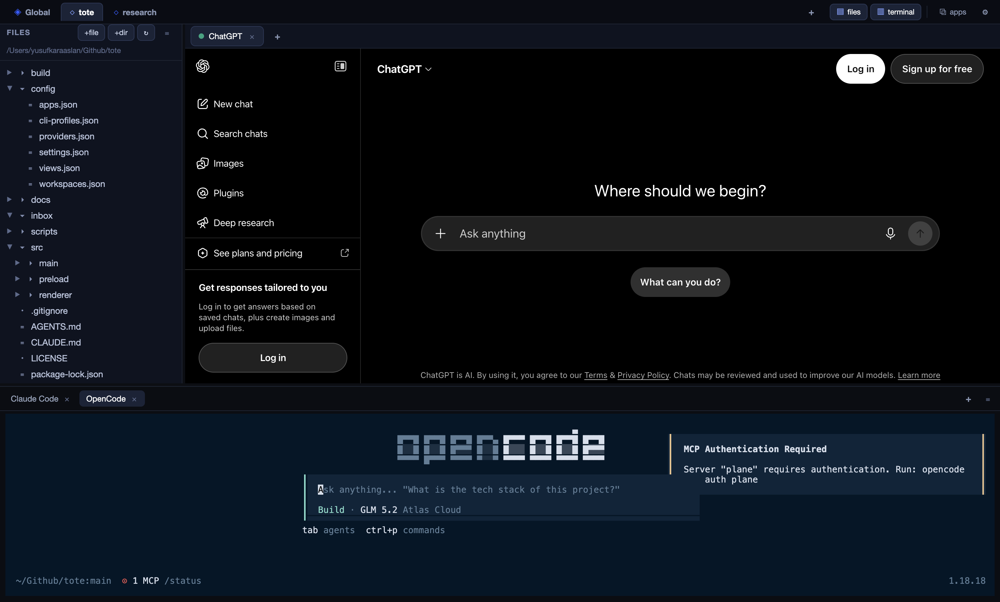
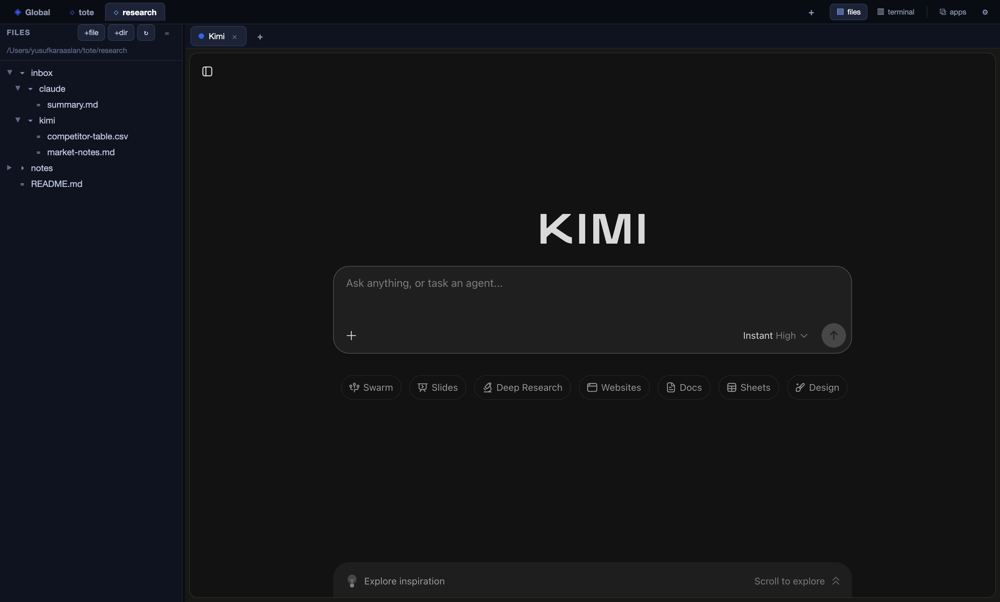
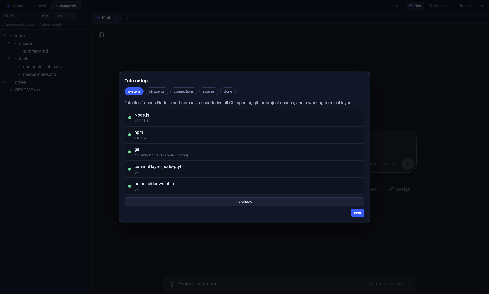

# Tote

**One window for all your LLMs — organized around workspaces, not chats.**

*Tote: a bag you carry everything in.* Web LLM tabs, native apps and CLI agents
(Claude Code, Codex, Gemini CLI, Kimi, OpenCode) live in one window; switch a
workspace and every tab, terminal, download and layout follows.



Tote doesn't try to merge every model into one conversation. Instead it gives you
**spaces**: one Global workspace plus as many project workspaces as you like. A workspace
is the routing context — when a space is active, every frontend you fire (web LLM tab,
native app, or CLI agent) works against *that folder*, and every file that lands goes
to the right place. Research in a web tab, download, resume in Claude Code — no manual
file shuffling.

## The workflow it exists for

1. Click your project space on the top strip (e.g. `nexus-core`).
2. Open the **Kimi** or **Claude** web tab, do your research, hit download —
   the file lands in `nexus-core/inbox/kimi/`, not your Downloads folder.
3. Pop the terminal panel (Ctrl+`), fire **Claude Code** — it starts `cd`'d into
   `nexus-core`. Say "continue from inbox/kimi/…". Tip: `claude -c` and `kimi -C`
   resume the agent's previous session directly.
4. Prefer the vendor's native app (app-only discounts, voice, etc.)? Launch it
   from the **apps** menu — what it downloads to your system Downloads is copied
   into the active workspace automatically. Claude Desktop is even bound to the
   workspace folder over MCP before launch, so it opens *on* that folder.

## Screenshots

| Agents docked at the bottom (Claude Code + OpenCode) | A *research* space: `inbox/<provider>/` collects downloads, Kimi tab open |
|---|---|
|  |  |

First-run setup wizard — system checks, one-click CLI installs, connections, spaces:



## Quick start

Requires **Node.js 20+** and (for terminals) a C++ toolchain:

- **Linux:** `sudo apt install build-essential python3`
- **macOS:** Xcode Command Line Tools (`xcode-select --install`)
- **Windows:** Visual Studio Build Tools

```bash
./scripts/install.sh        # checks prerequisites, installs deps, launches
# or manually:
npm install && npm start
```

**First launch opens the setup wizard**, which does the wiring for you:

1. **System** — verifies Node, npm, git, the terminal layer, home-folder access.
2. **CLI agents** — one-click installs with live terminal output:
   `claude` (@anthropic-ai/claude-code), `kimi` (@moonshot-ai/kimi-code),
   `codex` (@openai/codex), `gemini` (@google/gemini-cli), `opencode` (opencode-ai).
   (DeepSeek Harness has no interactive CLI — use its local Web UI tab instead.)
3. **Connections** — binds Claude Desktop to the active workspace via MCP
   (with config backup) and gives you a copy-paste MCP snippet for
   Cursor / Cherry Studio / Kimi Code `/mcp-config`.
4. **Spaces** — review Global + add project workspaces.

Reopen anytime: **settings → run setup wizard**.

Upgrading from an install named **OmniHub**? Quit it first, then start Tote — your
config, logins and Claude Desktop binding are migrated automatically on first launch.

Troubleshooting: if terminals fail with `posix_spawnp failed`, run `npm install` again
(the postinstall step restores the exec bit on node-pty's `spawn-helper`). Agent terminals
run through your login shell, so a CLI that works in your own terminal works here too —
including ones installed via fnm/nvm/asdf, which a desktop app otherwise can't see. Right-click a
web tab for **reload** / **close**.

### Build real installers

```bash
npm run dist        # current platform → dist/
npm run dist:linux  # AppImage + .deb
npm run dist:mac    # .dmg (must build on macOS)
npm run dist:win    # NSIS setup .exe (desktop + start-menu shortcuts)
```

The NSIS installer is non-one-click, so users can choose the install directory.

First run creates the **Global** space at `~/tote/workspace`. Add project spaces
with **+ space** on the top strip (name + any folder on disk — point it at an
existing project if you like). Right-click a space tab to open its folder, copy the
path, rename it, point it at a different folder, or remove it — the same controls live under
**settings → Workspaces**. Tote never deletes or moves files: removing a space only
unregisters it, and changing its folder just re-points it.

## How each frontend honors "the correct workspace"

| Frontend | Mechanism | Reliability |
|---|---|---|
| Web LLM tabs | Per-session download interception → `<active>/inbox/<provider>/` | solid |
| CLI agents | New PTY spawns with `cwd = <active>`; tab tagged with its space | solid |
| Claude Desktop | MCP filesystem server bound to `<active>` written into `claude_desktop_config.json` (with .bak backup) before launch | solid (restart app if already open) |
| Other native apps | Downloads-folder bridge: files the app downloads are copied into `<active>/inbox/_desktop/`, originals left in place | macOS only (toggle in Settings) |

## What's inside

- **Web tabs** — open any of Kimi, Claude, ChatGPT, Gemini, MiniMax, Z.ai, Qwen, DeepSeek,
  or the DeepSeek Harness local Web UI (auto-starts `npx -y @deepseek-ai/dsh web`) from the
  **+** menu — as many tabs of the same LLM as you like. Each provider is an isolated
  persistent partition: log in once, forever. **Tabs belong to the workspace**: switch
  spaces and you get that space's tabs (and terminals) back exactly as you left them.
- **Terminals** — Claude Code, Kimi CLI, Codex, Gemini CLI, OpenCode, plain shell. Real PTYs (node-pty), so full-screen TUIs render correctly. Green/red dots
  show what's on your PATH.
- **Layout** — files and terminal panels each dock left / bottom / right (≡ menu on the panel bar)
  and resize with a drag splitter; positions, sizes and open/closed state are remembered **per workspace**.
- **Workspace pane** — tree, inline text editor, right-click new/rename/trash/
  open-externally/copy-path, and **Send to active tab (experimental)** which injects a
  file into the current chat's upload control.
- **Settings** — manage workspaces (add / rename / change folder / remove), add/remove
  providers, CLI profiles, native apps; toggle the Downloads bridge. Everything is plain JSON in `<userData>/config/` (**open config folder**).

## Architecture

```
config/            defaults: providers, cli-profiles, workspaces, apps, settings
scripts/           copy-vendor (xterm assets), install.sh bootstrap
build/icon.png     app icon used by electron-builder
src/main/
  main.js          window, sessions, downloads routing, bridge, apps launcher, IPC
  installer.js     system checks, Claude MCP binding, MCP snippet, CLI status
  config.js        userData config store (JSON)
  workspace.js     spaces registry, safe paths, tree, ingest(), chokidar watchers
  ptyManager.js    node-pty sessions for CLI agents
src/preload/       contextBridge API (renderer has no node access)
src/renderer/      vanilla JS UI: switcher, tabs, tree, editor, xterm, wizard, settings
```

Design rules:

1. **The active workspace is the only routing context.** Every download handler and
   terminal spawn resolves it at event time, so switching spaces re-routes instantly.
2. **Providers, profiles, workspaces and apps are data, not code.** Add yours in Settings.
3. **Native apps can't be embedded** — they're launched and bridged, never swallowed.
   App-exclusive perks (discounts, voice, Sora, Claude Projects) stay reachable that way.
4. **Vendor clouds stay siloed.** Chat history inside kimi.com stays there; Tote
   unifies the file layer, not the account layer.

## Roadmap

- Global hotkey + tray (summon from anywhere)
- Per-workspace download rules (e.g. `.zip` → `assets/`)
- Git/Syncthing-backed space sync across machines
- House agent via DeepSeek Harness plugin with workspace tools
- Context bus: send selection/conversation between panes

## License

MIT
